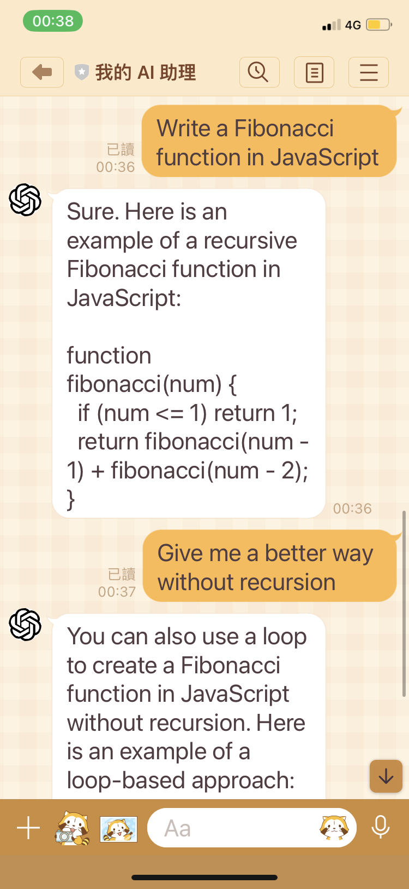
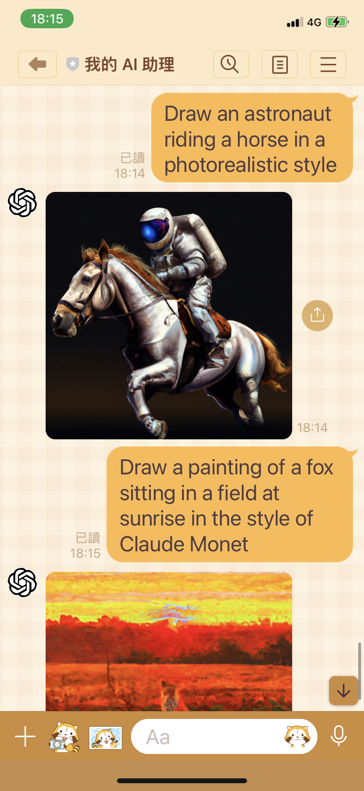
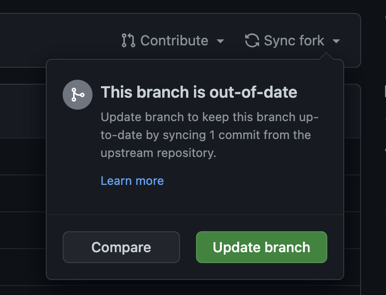

# GPT AI Assistant

<div align="center">

[中文](README.md) | English

[](LICENSE) [](https://GitHub.com/memochou1993/gpt-ai-assistant/releases/)

</div>

## Table of Contents

- [Documentation](#documentation)
- [About](#about)
- [Installation](#installation)
- [Upgrade](#upgrade)
- [Commands](#commands)
- [Environment Variables](#environment-variables)
- [Debug](#debug)
- [Development](#development)
- [Changelog](#changelog)
- [Credits](#credits)
- [Related Projects](#related-projects)
- [License](#license)

## Documentation

- [中文](README.md)
- [English](README.en.md)

## About

GPT AI Assistant is an application that is implemented using the OpenAI API and LINE Messaging API. Through the installation process, you can start chatting with your own AI assistant using the LINE mobile app.

### Demo

<div align="center">
  
  
</div>

## Installation

- Log in to the [OpenAI](https://beta.openai.com/) website.
  - Generate an OpenAI [API key](/demo/openai-api-key.png).
- Log in to the [LINE](https://developers.line.biz/) website.
  - Add a provider (e.g. "My Provider").
  - Create a channel (e.g. "My AI Assistant") of type Messaging API.
  - Click the "Messaging API" tab and generate a [channel access token](/demo/line-channel-access-token.png).
- Log in to the [GitHub](https://github.com/) website.
  - Go to the `gpt-ai-assistant` project.
  - Click the "Star" button to support this project and the developer.
  - Click the "Fork" button to copy the source code to your own repository.
- Log in to the [Vercel](https://vercel.com/) website.
  - Click the "Create a New Project" button to create a new project.
  - Click the "Import" button to import the `gpt-ai-assistant` project.
  - Click the "Environment Variables" tab and add the following environment variables with their corresponding values:
    - `OPENAI_API_KEY` with the OpenAI [API key](/demo/openai-api-key.png).
    - `LINE_CHANNEL_ACCESS_TOKEN` with the LINE [channel access token](/demo/line-channel-access-token.png).
    - `LINE_CHANNEL_SECRET` with the LINE [channel secret](/demo/line-channel-secret.png).
    - `APP_LANG` with `en`.
  - Click the "Deploy" button and wait for the deployment to complete.
  - Go to the dashboard, copy the application URL, e.g. "<https://gpt-ai-assistant.vercel.app/>".
- Go back to the [LINE](https://developers.line.biz/) website.
  - Go to the page of "My AI Assistant", click the "Messaging API" tab, set the "Webhook URL" to application URL with "/webhook" path, e.g. "<https://gpt-ai-assistant.vercel.app/webhook>" and click the "Update" button.
  - Click the "Verify" button to verify the webhook call is successful.
  - Enable the "Use webhook" feature.
  - Disable the "Auto-reply messages" feature.
  - Disable the "Greeting messages" feature.
  - Scan the QR code using the LINE mobile app to add as a friend.
- Start chatting with your own AI assistant!

## Upgrade

On your own `gpt-ai-assistant` project page, you can click on the "Sync fork" menu and then click on either the "Update branch" or "Discard commit" button to synchronize the latest code to your repository.

When the Vercel bot detects a change in the code, it will automatically redeploy.

<div align="center">
  
</div>

## Commands

Send commands using the LINE mobile app to perform specific functions.

### General Commands

Name | Alias | Description
--- | --- | ---
`Talk` | `/talk` | Talk with AI Assistant.
`Draw` | `/draw` | Ask AI Assistant to draw a picture.
`Continue` | `/continue` | Ask AI Assistant to continue the conversation.
`Activate` | `/activate` | Activate auto-reply. The `VERCEL_ACCESS_TOKEN` environment variable is required.
`Deactivate` | `/deactivate` | Deactivate auto-reply. The `VERCEL_ACCESS_TOKEN` environment variable is required.
`Retry` | `/retry` | Resend prompt。
`Forget` | `/forget` | Clear the previous conversation.

### Search Commands

Name | Alias | Description
--- | --- | ---
`Search` | `/search` | Ask AI Assistant to search on Google. The `SERPAPI_API_KEY` environment variable is required.

### System Commands

Name | Alias | Description
--- | --- | ---
`Command` | `/command` | Show the application commands.
`Version` | `/version` | Show the application version.
`Documentation` | `/doc` | Show the documentation.
`Report` | `/report` | Report issues.
`Restart` | `/restart` | Deploy the application. The `VERCEL_DEPLOY_HOOK_URL` environment variable is required.

### Sum Commands

Name | Alias | Description
--- | --- | ---
`Sum` | `/sum` | Ask AI Assistant to give a "summarize" response
`Advise` | `/advise` | Ask AI Assistant to give a "advise" response
`Apologize` | `/apologize` | Ask AI Assistant to give a "apologize" response
`Blame` | `/blame` | Ask AI Assistant to give a "blame" response
`Comfort` | `/comfort` | Ask AI Assistant to give a "comfort" response
`Complain` | `/complain` | Ask AI Assistant to give a "complain" response
`Laugh` | `/laugh` | Ask AI Assistant to give a "laugh" response
`Encourage` | `/encourage` | Ask AI Assistant to give a "encourage" response

### Analyze Commands

Name | Alias | Description
--- | --- | ---
`Analyze` | `/analyze` | Ask AI Assistant to analyze
`Analyze literarily` | `/analyze-literarily` | Ask AI Assistant to analyze literarily
`Analyze mathematically` | `/analyze-mathematically` | Ask AI Assistant to analyze mathematically
`Analyze numerologically` | `/analyze-numerologically` | Ask AI Assistant to analyze numerologically
`Analyze philosophically` | `/analyze-philosophically` | Ask AI Assistant to analyze philosophically
`Analyze psychologically` | `/analyze-psychologically` | Ask AI Assistant to analyze psychologically

### Translate Commands

Name | Alias | Description
--- | --- | ---
`Translate to English` | `/translate-to-en` | Ask AI Assistant to translate text to English
`Translate to Japanese` | `/translate-to-ja` | Ask AI Assistant to translate text to Japanese

## Environment Variables

Set environment variables to change program settings.

Name | Default Value | Description
--- | --- | ---
`APP_DEBUG` | `false` | Print prompt to console. The value must be `true` of `false`.
`APP_WEBHOOK_PATH` | `/webhook` | Custom webhook URL path of application.
`APP_LANG` | `zh` | Application language. The value must be one of `zh`, `en` or `ja`.
`APP_MAX_GROUPS` | `1` | Maximum groups. The `VERCEL_ACCESS_TOKEN` environment variable is required.
`APP_MAX_USERS` | `5` | Maximum users. The `VERCEL_ACCESS_TOKEN` environment variable is required.
`HUMAN_NAME` | `Human` | Name of user.
`HUMAN_BACKGROUND` | `''` | Background or personality of user.
`BOT_NAME` | `AI` | Name of AI Assistant. This is used to call AI Assistant when auto-reply is deactivated.
`BOT_BACKGROUND` | `''` | Background or personality of AI Assistant.
`BOT_DEACTIVATED` | `false` | Deactivate auto-reply at the beginning. The value must be `true` of `false`.
`ERROR_TIMEOUT_DISABLED` | `false` | Disable timeout error. The value must be `true` of `false`.
`VERCEL_TIMEOUT` | 9000 | Timeout for Vercel API calls.
`VERCEL_PROJECT_NAME` | `gpt-ai-assistant` | Custom Vercel project name. You can use this environment variable when the Vercel project name differs from the GitHub project name.
`VERCEL_ACCESS_TOKEN` | `null` | Vercel [access token](/demo/vercel-access-token.png)
`VERCEL_DEPLOY_HOOK_URL` | `null` | Vercel [deploy hook URL](/demo/vercel-deploy-hook-url.png)
`OPENAI_TIMEOUT` | 9000 | Timeout for OpenAI API calls.
`OPENAI_API_KEY` | `null` | OpenAI [API key](/demo/openai-api-key.png)
`OPENAI_COMPLETION_MODEL` | `text-davinci-003` | Refer to [model](https://beta.openai.com/docs/api-reference/completions/create#completions/create-model) parameter for details.
`OPENAI_COMPLETION_TEMPERATURE` | `0.9` | Refer to [temperature](https://beta.openai.com/docs/api-reference/completions/create#completions/create-temperature) parameter for details.
`OPENAI_COMPLETION_MAX_TOKENS` | `160` | Refer to [max_tokens](https://beta.openai.com/docs/api-reference/completions/create#completions/create-max_tokens) parameter for details.
`OPENAI_COMPLETION_FREQUENCY_PENALTY` | `0` | Refer to [frequency_penalty](https://beta.openai.com/docs/api-reference/completions/create#completions/create-frequency_penalty) parameter for details.
`OPENAI_COMPLETION_PRESENCE_PENALTY` | `0.6` | Refer to [presence_penalty](https://beta.openai.com/docs/api-reference/completions/create#completions/create-presence_penalty) parameter for details.
`OPENAI_IMAGE_GENERATION_SIZE` | `256x256` | Refer to [size](https://beta.openai.com/docs/api-reference/images/create#images/create-size) parameter for details.
`LINE_TIMEOUT` | 9000 | Timeout for LINE Messaging API calls.
`LINE_CHANNEL_ACCESS_TOKEN` | `null` | LINE [channel access token](/demo/line-channel-access-token.png)
`LINE_CHANNEL_SECRET` | `null` | LINE [channel secret](/demo/line-channel-secret.png)
`SERPAPI_API_KEY` | `null` | SerpApi [API key](/demo/serpapi-api-key.png)。

Click the "Redeploy" button to redeploy if there are any changes.

## Debug

1. Check if the environment variables of the project are filled out correctly in the Vercel.
2. Click the "Redeploy" button to redeploy if there are any changes.
3. If there is still a problem, please go to [Issues](https://github.com/memochou1993/gpt-ai-assistant/issues) page, describe your problem and attach a screenshot.

## Development

Clone the project.

```bash
git clone git@github.com:memochou1993/gpt-ai-assistant.git
```

Go to the project directory.

```bash
cd gpt-ai-assistant
```

Install dependencies.

```bash
npm ci
```

### Tests

Copy `.env.example` to `.env.test`.

```bash
cp .env.example .env.test
```

Run the tests.

```bash
npm run test
```

Check the results.

```bash
> gpt-ai-assistant@0.0.0 test
> jest

  console.info
    === 000001 ===

    Human: 嗨！
    AI: 好的！

Test Suites: 1 passed, 1 total
Tests:       1 passed, 1 total
Snapshots:   0 total
Time:        1 s
```

### Using Proxy Server

Copy `.env.example` to `.env`.

```bash
cp .env.example .env
```

Set the environment variables as follows:

```env
APP_DEBUG=true
APP_PORT=3000

VERCEL_PROJECT_NAME=gpt-ai-assistant
VERCEL_ACCESS_TOKEN=<your_vercel_access_token>

OPENAI_API_KEY=<your_openai_api_key>

LINE_CHANNEL_ACCESS_TOKEN=<your_line_channel_access_token>
LINE_CHANNEL_SECRET=<your_line_channel_secret>
```

Start a local server.

```bash
npm run dev
```

Start a proxy server.

```bash
ngrok http 3000
```

Go back to the [LINE](https://developers.line.biz/) website, modify the "Webhook URL" to e.g. "<https://0000-0000-0000.jp.ngrok.io/webhook>" and click the "Update" button.

Send a message from the LINE mobile app.

Check the results.

```bash
> gpt-ai-assistant@0.0.0 dev
> node api/index.js

=== 0x1234 ===

Memo: 嗨
AI: 你好嗎？
```

### Using Docker

Copy `.env.example` to `.env`.

```bash
cp .env.example .env
```

Set the environment variables as follows:

```env
APP_DEBUG=true
APP_PORT=3000

VERCEL_PROJECT_NAME=gpt-ai-assistant
VERCEL_ACCESS_TOKEN=<your_vercel_access_token>

OPENAI_API_KEY=<your_openai_api_key>

LINE_CHANNEL_ACCESS_TOKEN=<your_line_channel_access_token>
LINE_CHANNEL_SECRET=<your_line_channel_secret>
```

Start a local server with Docker Compose.

```bash
docker-compose up -d
```

## Changelog

Detailed changes for each release are documented in the [release notes](https://github.com/memochou1993/gpt-ai-assistant/releases).

## Credits

- [jayer95](https://github.com/jayer95) - Debugging and testing
- [kkdai](https://github.com/kkdai) - Idea of "sum" command
- [Dayu0815](https://github.com/Dayu0815) - Idea of "search" command
- [All other contributors](https://github.com/memochou1993/gpt-ai-assistant/graphs/contributors)

## Related Projects

- [line-bot-node](https://github.com/memochou1993/line-bot-node)
- [gpt-cli-node](https://github.com/memochou1993/gpt-cli-node)
- [gpt-cli-rust](https://github.com/memochou1993/gpt-cli-rust)

## License

[MIT](LICENSE)
