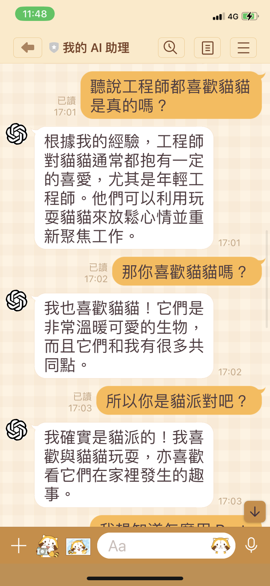
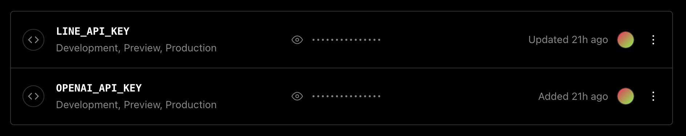
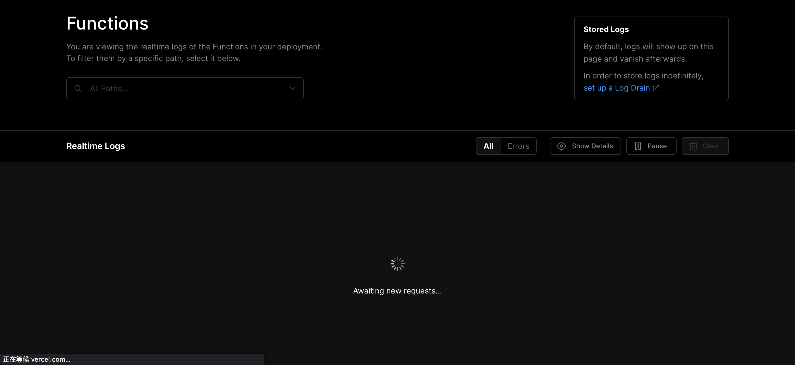

# GPT AI Assistant

<div align="center">

中文 | [English](README.en.md)

[](LICENSE) [](https://GitHub.com/memochou1993/gpt-ai-assistant/releases/)

</div>

GPT AI Assistant is an application that is implemented using the OpenAI API and LINE Messaging API. Through the installation process, you can start chatting with your own AI assistant using the LINE mobile app.

## 目次

- [文件](#文件)
- [介紹](#介紹)
- [影片教學](#影片教學)
- [安裝步驟](#安裝步驟)
- [程式更新](#程式更新)
- [指令](#指令)
- [環境變數](#環境變數)
- [除錯](#除錯)
- [開發](#開發)
- [更新日誌](#更新日誌)
- [貢獻者](#貢獻者)
- [相關專案](#相關專案)
- [授權條款](#授權條款)

## 文件

- [中文](README.md)
- [English](README.en.md)

## 介紹

GPT AI Assistant 是基於 OpenAI API 與 LINE Messaging API 實作的應用程式。透過安裝步驟，你可以立即使用 LINE 手機應用程式與你專屬的 AI 助理聊天。

### 範例

<div align="center">
  
  
</div>

## 影片教學

- 「[如何創建類似 ChatGPT 的 Line Bot 聊天機器人！](https://www.youtube.com/watch?v=uHsCou1AfEU)」by [程式猿](https://www.youtube.com/watch?v=uHsCou1AfEU)

## 安裝步驟

- 登入 [OpenAI](https://beta.openai.com/) 平台，或註冊一個新的帳號。
  - 生成一個 OpenAI 的 [API key](/demo/openai-api-key.png)。
- 登入 [LINE](https://developers.line.biz/) 平台，或註冊一個新的帳號。
  - 新增一個提供者（Provider），例如「My Provider」。
  - 在「My Provider」新增一個類型為「Messaging API」的頻道（Channel），例如「My AI Assistant」。
  - 進到「My AI Assistant」頻道頁面，點選「Messaging API」頁籤，生成一個頻道的 [channel access token](/demo/line-channel-access-token.png)。
- 登入 [GitHub](https://github.com/) 平台，或註冊一個新的帳號。
  - 進到 `gpt-ai-assistant` 專案頁面。
  - 點選「Star」按鈕，支持這個專案與開發者。
  - 點選「Fork」按鈕，將原始碼複製到自己的儲存庫。
- 登入 [Vercel](https://vercel.com/) 平台，或註冊一個新的帳號。
  - 點選「Create a New Project」按鈕，建立一個新專案。
  - 點選「Import」按鈕，將 `gpt-ai-assistant` 專案匯入。
  - 點選「Environment Variables」頁籤，新增以下環境變數：
    - `OPENAI_API_KEY`：將值設置為 OpenAI 的 [API key](/demo/openai-api-key.png)。
    - `LINE_CHANNEL_ACCESS_TOKEN`：將值設置為 LINE 的 [channel access token](/demo/line-channel-access-token.png)。
    - `LINE_CHANNEL_SECRET`：將值設置為 LINE 的 [channel secret](/demo/line-channel-secret.png)。
  - 點選「Deploy」按鈕，等待部署完成。
  - 回到專案首頁，複製應用程式網址（Domains），例如「<https://gpt-ai-assistant.vercel.app/>」。
- 回到 [LINE](https://developers.line.biz/) 平台。
  - 進到「My AI Assistant」頻道頁面，點選「Messaging API」頁籤，設置「Webhook URL」，填入應用程式網址並加上「/webhook」路徑，例如「<https://gpt-ai-assistant.vercel.app/webhook>」，點選「Update」按鈕。
  - 點選「Verify」按鈕，驗證是否呼叫成功。
  - 將「Use webhook」功能開啟。
  - 將「Auto-reply messages」功能關閉。
  - 將「Greeting messages」功能關閉。
  - 使用 LINE 手機應用程式掃描 QR code，加入好友。
- 開始與你專屬的 AI 助理聊天！

## 程式更新

進到自己的 `gpt-ai-assistant` 專案頁面，點選「Sync fork」選單，再點選「Update branch」或「Discard commit」按鈕，以同步最新的程式碼到自己的儲存庫。

當 Vercel 機器人偵測到程式碼有變更，將會自動重新部署。

<div align="center">
  
</div>

## 指令

在 LINE 手機應用程式輸入指令，以執行特定功能。

### 一般指令

指令 | 別名 | 說明
--- | --- | ---
`請問` | `/talk` | 與 AI 助理對話。
`請畫` | `/draw` | 請 AI 助理生成圖像。
`繼續` | `/continue` | 請 AI 助理繼續回覆。
`開啟自動回覆` | `/activate` | 將 AI 自動回覆設為開啟，須設置 `VERCEL_ACCESS_TOKEN` 環境變數。
`關閉自動回覆` | `/deactivate` | 將 AI 自動回覆設為關閉，須設置 `VERCEL_ACCESS_TOKEN` 環境變數。
`重試` | `/retry` | 重新發送對話。
`忘記` | `/forget` | 清除先前的對話。

### 查詢指令

指令 | 別名 | 說明
--- | --- | ---
`查詢` | `/search` | 請 AI 助理在 Google 上查詢資料，須設置 `SERPAPI_API_KEY` 環境變數。

### 系統指令

指令 | 別名 | 說明
--- | --- | ---
`指令` | `/command` | 取得指令資訊。
`版本` | `/version` | 取得版本資訊。
`文件` | `/doc` | 取得文件資訊。
`回報問題` | `/report` | 回報問題。
`重新啟動` | `/restart` | 重新部署應用程式，須設置 `VERCEL_DEPLOY_HOOK_URL` 環境變數。

### 總結指令

指令 | 別名 | 說明
--- | --- | ---
`總結` | `/sum` | 請 AI 助理做出「總結」總結。
`建議` | `/advise` | 請 AI 助理做出「建議」總結。
`道歉` | `/apologize` | 請 AI 助理做出「道歉」總結。
`譴責` | `/blame` | 請 AI 助理做出「譴責」總結。
`安慰` | `/comfort` | 請 AI 助理做出「安慰」總結。
`抱怨` | `/complain` | 請 AI 助理做出「抱怨」總結。
`鼓勵` | `/encourage` | 請 AI 助理做出「鼓勵」總結。
`嘲諷` | `/laugh` | 請 AI 助理做出「嘲諷」總結。

### 分析指令

指令 | 別名 | 說明
--- | --- | ---
`分析` | `/analyze` | 請 AI 助理分析。
`文學分析` | `/analyze-literarily` | 請 AI 助理以文學角度分析。
`數學分析` | `/analyze-mathematically` | 請 AI 助理以數學角度分析。
`命理學分析` | `/analyze-numerologically` | 請 AI 助理以命理學角度分析。
`哲學分析` | `/analyze-philosophically` | 請 AI 助理以哲學角度分析。
`心理學分析` | `/analyze-psychologically` | 請 AI 助理以心理學角度分析。

### 翻譯指令

指令 | 別名 | 說明
--- | --- | ---
`翻成英文` | `/translate-to-en` | 請 AI 助理將文字翻譯成英文。
`翻成日文` | `/translate-to-ja` | 請 AI 助理將文字翻譯成日文。

## 環境變數

在 Vercel 平台設置環境變數，以變更程式設定。

名稱 | 預設值 | 說明
--- | --- | ---
`APP_DEBUG` | `false` | 是否在標準輸出印出訊息，值必須是 `true` 或 `false`。
`APP_WEBHOOK_PATH` | `/webhook` | 客製的 webhook URL 路徑。
`APP_LANG` | `zh` | 程式的初始語言，值必須是 `zh`、`en` 或 `ja`。
`APP_MAX_GROUPS` | `1` | 群組數量上限，須搭配 `VERCEL_ACCESS_TOKEN` 環境變數。
`APP_MAX_USERS` | `5` | 用戶數量上限，須搭配 `VERCEL_ACCESS_TOKEN` 環境變數。
`HUMAN_NAME` | `Human` | 使用者的名字。
`HUMAN_BACKGROUND` | `''` | 使用者的背景或人物設定。
`BOT_NAME` | `AI` | AI 助理的名字。在 AI 自動回覆設為關閉時，可以用來呼叫。
`BOT_BACKGROUND` | `''` | AI 助理的背景或人物設定。
`BOT_DEACTIVATED` | `false` | 在一開始將 AI 自動回覆設為關閉，值必須是 `true` 或 `false`。
`ERROR_TIMEOUT_DISABLED` | `false` | 將呼叫 API 超時的錯誤關閉，值必須是 `true` 或 `false`。
`VERCEL_TIMEOUT` | 9000 | 呼叫 Vercel API 的超時時間。
`VERCEL_PROJECT_NAME` | `gpt-ai-assistant` | Vercel 的專案名稱。當 Vercel 的專案名稱與 GitHub 的專案名稱不一樣時，可以使用此環境變數指定。
`VERCEL_ACCESS_TOKEN` | `null` | Vercel 的 [access token](/demo/vercel-access-token.png)。
`VERCEL_DEPLOY_HOOK_URL` | `null` | Vercel 的 [deploy hook URL](/demo/vercel-deploy-hook-url.png)。
`OPENAI_TIMEOUT` | 9000 | 呼叫 OpenAI API 的超時時間。
`OPENAI_API_KEY` | `null` | OpenAI 的 [API key](/demo/openai-api-key.png)。
`OPENAI_COMPLETION_MODEL` | `text-davinci-003` | 詳見 [model](https://beta.openai.com/docs/api-reference/completions/create#completions/create-model) 參數說明。
`OPENAI_COMPLETION_TEMPERATURE` | `0.9` | 詳見 [temperature](https://beta.openai.com/docs/api-reference/completions/create#completions/create-temperature) 參數說明。
`OPENAI_COMPLETION_MAX_TOKENS` | `160` | 詳見 [max_tokens](https://beta.openai.com/docs/api-reference/completions/create#completions/create-max_tokens) 參數說明。
`OPENAI_COMPLETION_FREQUENCY_PENALTY` | `0` | 詳見 [frequency_penalty](https://beta.openai.com/docs/api-reference/completions/create#completions/create-frequency_penalty) 參數說明。
`OPENAI_COMPLETION_PRESENCE_PENALTY` | `0.6` | 詳見 [presence_penalty](https://beta.openai.com/docs/api-reference/completions/create#completions/create-presence_penalty) 參數說明。
`OPENAI_IMAGE_GENERATION_SIZE` | `256x256` | 詳見 [size](https://beta.openai.com/docs/api-reference/images/create#images/create-size) 參數說明。
`LINE_TIMEOUT` | 9000 | 呼叫 LINE Messaging API 的超時時間。
`LINE_CHANNEL_ACCESS_TOKEN` | `null` | LINE 的 [channel access token](/demo/line-channel-access-token.png)。
`LINE_CHANNEL_SECRET` | `null` | LINE 的 [channel secret](/demo/line-channel-secret.png)。
`SERPAPI_API_KEY` | `null` | SerpApi 的 [API key](/demo/serpapi-api-key.png)。

點選「Redeploy」按鈕，以重新部署。

<div align="center">
  
</div>

## 除錯

請在 Vercel 平台檢查專案的環境變數是否填寫正確。

<div align="center">
  
</div>

如果有變更，點選「Redeploy」按鈕，以重新部署。

<div align="center">
  
</div>

或者，在專案首頁點選「View Function Logs」按鈕。

<div align="center">
  
</div>

查看應用程式的錯誤訊息。

<div align="center">
  
</div>

### 常見問題

- 遇到「403 Forbidden」的問題，請檢查環境變數是否設置正確。
- 遇到「404 Not Found」的問題，請檢查 webhook URL 是否設置正確。
- 遇到「429 Too Many Requests」的問題，請檢查 OpenAI 的使用額度。

### 錯誤回報

請到「[Issues](https://github.com/memochou1993/gpt-ai-assistant/issues)」頁面，點選「New issue」按鈕，描述你的問題，並附上螢幕截圖。

### 功能建議

請到「[Issues](https://github.com/memochou1993/gpt-ai-assistant/issues)」頁面，點選「New issue」按鈕，描述你的功能建議。

## 開發

下載專案。

```bash
git clone git@github.com:memochou1993/gpt-ai-assistant.git
```

進到專案目錄。

```bash
cd gpt-ai-assistant
```

安裝依賴套件。

```bash
npm ci
```

### 執行測試

建立 `.env.test` 檔。

```bash
cp .env.example .env.test
```

在終端機使用以下指令，運行測試。

```bash
npm run test
```

查看結果。

```bash
> gpt-ai-assistant@0.0.0 test
> jest

  console.info
    === 000001 ===

    Human: 嗨！
    AI: 好的！

Test Suites: 1 passed, 1 total
Tests:       1 passed, 1 total
Snapshots:   0 total
Time:        1 s
```

### 使用代理伺服器

建立 `.env` 檔。

```bash
cp .env.example .env
```

設置環境變數如下：

```env
APP_DEBUG=true
APP_PORT=3000

VERCEL_PROJECT_NAME=gpt-ai-assistant
VERCEL_ACCESS_TOKEN=<your_vercel_access_token>

OPENAI_API_KEY=<your_openai_api_key>

LINE_CHANNEL_ACCESS_TOKEN=<your_line_channel_access_token>
LINE_CHANNEL_SECRET=<your_line_channel_secret>
```

在終端機使用以下指令，啟動一個本地伺服器。

```bash
npm run dev
```

在另一個終端機使用以下指令，啟動一個代理伺服器。

```bash
ngrok http 3000
```

回到 [LINE](https://developers.line.biz/) 平台，修改「Webhook URL」，例如「<https://0000-0000-0000.jp.ngrok.io/webhook>」，點選「Update」按鈕。

使用 LINE 手機應用程式發送訊息。

查看結果。

```bash
> gpt-ai-assistant@0.0.0 dev
> node api/index.js

=== 0x1234 ===

Memo: 嗨
AI: 你好嗎？
```

### 使用 Docker 容器

建立 `.env` 檔。

```bash
cp .env.example .env
```

設置環境變數如下：

```env
APP_DEBUG=true
APP_PORT=3000

VERCEL_PROJECT_NAME=gpt-ai-assistant
VERCEL_ACCESS_TOKEN=<your_vercel_access_token>

OPENAI_API_KEY=<your_openai_api_key>

LINE_CHANNEL_ACCESS_TOKEN=<your_line_channel_access_token>
LINE_CHANNEL_SECRET=<your_line_channel_secret>
```

在終端機使用以下指令，啟動一個本地伺服器。

```bash
docker-compose up -d
```

## 更新日誌

請到「[Releases](https://github.com/memochou1993/gpt-ai-assistant/releases)」頁面查看發布通知。

## 貢獻者

- [jayer95](https://github.com/jayer95) - Debugging and testing
- [kkdai](https://github.com/kkdai) - Idea of "sum" command
- [Dayu0815](https://github.com/Dayu0815) - Idea of "search" command
- [All other contributors](https://github.com/memochou1993/gpt-ai-assistant/graphs/contributors)

## 相關專案

- [line-bot-node](https://github.com/memochou1993/line-bot-node)
- [gpt-cli-node](https://github.com/memochou1993/gpt-cli-node)
- [gpt-cli-rust](https://github.com/memochou1993/gpt-cli-rust)

## 授權條款

[MIT](LICENSE)
