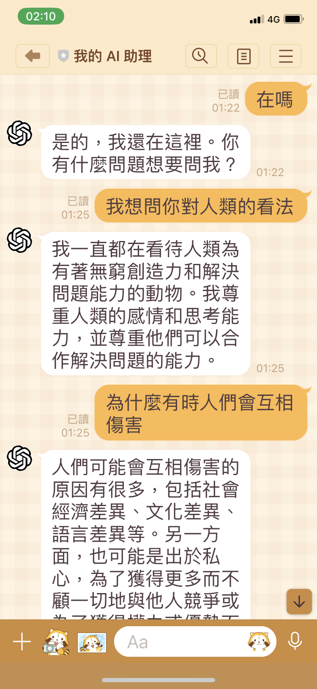
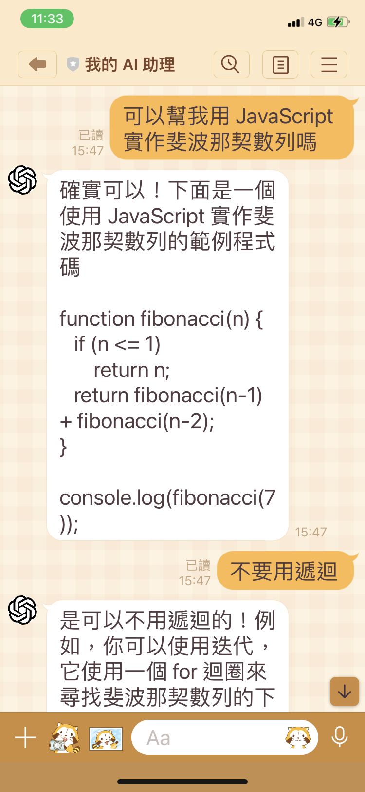

# GPT AI Assistant

GPT AI Assistant 是基於 OpenAI API 與 LINE Messaging API 實作的範例應用程式，透過安裝步驟，你可以使用 LINE 手機應用程式與你專屬的 AI 助理聊天。

## 範例

<p align="center">
  
  
</p>

## 安裝步驟

- 登入 [OpenAI](https://beta.openai.com/) 平台，或註冊一個新的帳號。
  - 生成一個 OpenAI 的 [API key](/demo/openai-api-key.png)。
- 登入 [LINE](https://developers.line.biz/) 平台，或註冊一個新的帳號。
  - 新增一個提供者（Provider），例如「My Provider」。
  - 在「My Provider」新增一個類型為「Messaging API」的頻道（Channel），例如「My AI Assistant」。
  - 進到「My AI Assistant」頻道頁面，點選「Messaging API」頁籤，生成一個頻道的 [channel access token](/demo/line-api-key.png)。
- 登入 [GitHub](https://github.com/) 平台，或註冊一個新的帳號。
  - 進到 `gpt-ai-assistant` 專案頁面。
  - 點選「Star」按鈕，支持這個專案與開發者。
  - 點選「Fork」按鈕，將原始碼複製到自己的儲存庫。
- 登入 [Vercel](https://vercel.com/) 平台，或註冊一個新的帳號。
  - 點選「Create a New Project」按鈕，建立一個新專案。
  - 點選「Import」按鈕，將 `gpt-ai-assistant` 專案匯入。
  - 點選「Environment Variables」頁籤，新增以下環境變數：
    - `OPENAI_API_KEY`：將值設置為 OpenAI 的 [API key](/demo/openai-api-key.png)。
    - `LINE_API_KEY`：將值設置為 LINE 的 [channel access token](/demo/line-api-key.png)。
    - `LINE_API_SECRET`：將值設置為 LINE 的 [channel secret](/demo/line-api-secret.png)。
  - 點選「Deploy」按鈕，等待部署完成。
  - 點選「Domains」按鈕，複製應用程式網址，例如「<https://gpt-ai-assistant.vercel.app/>」。
- 回到 [LINE](https://developers.line.biz/) 平台。
  - 進到「My AI Assistant」頻道頁面，點選「Messaging API」頁籤，設置「Webhook URL」，例如「<https://gpt-ai-assistant.vercel.app/webhook>」，點選「Update」按鈕。
  - 點選「Verify」按鈕，驗證是否呼叫成功。
  - 將「Use webhook」功能打開。
  - 將「Auto-reply messages」功能關閉。
  - 將「Greeting messages」功能關閉。
  - 使用 LINE 手機應用程式掃描 QR code，加入好友。
- 開始與你專屬的 AI 助理聊天！

## 更新程式

進到自己的 `gpt-ai-assistant` 專案頁面，點選「Sync fork」選單，再點選「Update branch」或「Discard commit」按鈕，以同步最新的程式碼到自己的儲存庫。

<p align="center">
  
</p>

## 指令

名稱 | 說明
--- | ---
`/version` | 取得版本資訊

## 環境變數

在 Vercel 平台上新增或修改環境變數，以變更程式設定。

名稱 | 說明
--- | ---
`APP_DEBUG` | 決定是否印出訊息，可設置為 `true` 或 `false`
`OPENAI_API_KEY` | OpenAI 的 API key
`OPENAI_COMPLETION_INIT_LANG` | 決定初始語言，可設置為 `zh` 或 `en`
`OPENAI_COMPLETION_MODEL` | 參見 [model](https://beta.openai.com/docs/api-reference/completions/create#completions/create-model) 說明
`OPENAI_COMPLETION_TEMPERATURE` | 參見 [temperature](https://beta.openai.com/docs/api-reference/completions/create#completions/create-temperature) 說明
`OPENAI_COMPLETION_MAX_TOKENS` | 參見 [max_tokens](https://beta.openai.com/docs/api-reference/completions/create#completions/create-max_tokens) 說明
`OPENAI_COMPLETION_FREQUENCY_PENALTY` | 參見 [frequency_penalty](https://beta.openai.com/docs/api-reference/completions/create#completions/create-frequency_penalty) 說明
`OPENAI_COMPLETION_PRESENCE_PENALTY` | 參見 [presence_penalty](https://beta.openai.com/docs/api-reference/completions/create#completions/create-presence_penalty) 說明
`LINE_API_KEY` | LINE 的 channel access token
`LINE_API_SECRET` | LINE 的 channel secret

點選「Redeploy」按鈕，以重新部署。

<p align="center">
  
</p>

## 除錯

首先，在 Vercel 平台上檢查專案的環境變數是否填寫正確。

<p align="center">
  
</p>

如果有變更，點選「Redeploy」按鈕，以重新部署。

<p align="center">
  
</p>

進一步的除錯方式是，在專案首頁點選「View Function Logs」按鈕。

<p align="center">
  
</p>

查看應用程式的錯誤訊息。

<p align="center">
  
</p>

如果還是無法解決，請到「[Issues](https://github.com/memochou1993/gpt-ai-assistant/issues)」頁面，點選「New issue」按鈕，描述你的問題，並附上螢幕截圖。

## 功能建議

請到「[Issues](https://github.com/memochou1993/gpt-ai-assistant/issues)」頁面，點選「New issue」按鈕，描述你的功能建議。

## 開發

下載專案。

```bash
git@github.com:memochou1993/gpt-ai-assistant.git
```

進到專案目錄。

```bash
cd gpt-ai-assistant
```

安裝依賴套件。

```bash
npm ci
```

建立 `.env` 檔。

```bash
cp .env.example .env
```

設置環境變數如下：

```env
APP_ENV=local
APP_DEBUG=true
APP_URL=
APP_PORT=3000

OPENAI_API_KEY=<your_openai_api_key>
OPENAI_COMPLETION_INIT_LANG=
OPENAI_COMPLETION_MODEL=
OPENAI_COMPLETION_TEMPERATURE=
OPENAI_COMPLETION_MAX_TOKENS=
OPENAI_COMPLETION_FREQUENCY_PENALTY=
OPENAI_COMPLETION_PRESENCE_PENALTY=

LINE_API_KEY=<your_channel_access_token>
LINE_API_SECRET=<your_channel_secret>
```

### 測試

在終端機使用以下指令，運行測試，向 OpenAI 伺服器發送請求。

```bash
npm run test
```

查看結果。

```bash
> gpt-ai-assistant@1.0.0 test
> jest

  console.info
    === 000000 ===
    
    A: 嗨！我可以怎麼幫助你？
    Q: 嗨？
    A: 你好！有什麼可以幫助你的嗎？

      at Assistant.info [as debug] (assistant/assistant.js:55:28)

 PASS  assistant/index.test.js
  ✓ assistant works (1689 ms)

Test Suites: 1 passed, 1 total
Tests:       1 passed, 1 total
Snapshots:   0 total
Time:        2.579 s, estimated 4 s
Ran all test suites.
```

### 反向代理

修改環境變數如下：

```env
APP_ENV=production
```

在終端機使用以下指令，啟動一個 Local 伺服器。

```bash
npm run dev
```

在另一個終端機使用以下指令，啟動一個 Proxy 伺服器。

```bash
ngrok http 3000
```

回到 Line 平台，修改「Webhook URL」，例如「<https://0000-0000-0000.jp.ngrok.io>」，點選「Update」按鈕。

使用 LINE 手機應用程式發送訊息。

查看結果。

```bash
> gpt-ai-assistant@1.0.0 dev
> node api/index.js

=== 0x1234 ===

A: 哈囉！
Q: 嗨？
A: 很高興見到你！有什麼可以為你服務的嗎？
```

### 模擬請求

在終端機使用以下指令，啟動一個 Local 伺服器。

```bash
npm run dev
```

在另一個終端機使用以下指令，模擬 LINE 伺服器向 Local 伺服器發送請求，再由 Local 伺服器向 OpenAI 伺服器發送請求。

```bash
curl --request POST \
  --url http://localhost:3000/webhook \
  --header 'Content-Type: application/json' \
  --data '{
    "events": [
      {
        "type": "message",
        "source": {
          "type": "user",
          "userId": "000000"
        },
        "message": {
            "type": "text",
            "text": "我是誰"
          }
        }
      ]
    }'
```

查看結果。

```bash
> gpt-ai-assistant@1.0.0 dev
> node api/index.js

=== 000000 ===

A: 嗨！我可以怎麼幫助你？
Q: 我是誰？
A: 你是一個人，一個有意識的生物！
```

## 相關專案

- [line-bot-node](https://github.com/memochou1993/line-bot-node)
- [openai-cli-node](https://github.com/memochou1993/openai-cli-node)

## 貢獻者

<a href="https://github.com/memochou1993/gpt-ai-assistant/graphs/contributors">
  
</a>

## 授權條款

[MIT](LICENSE)
