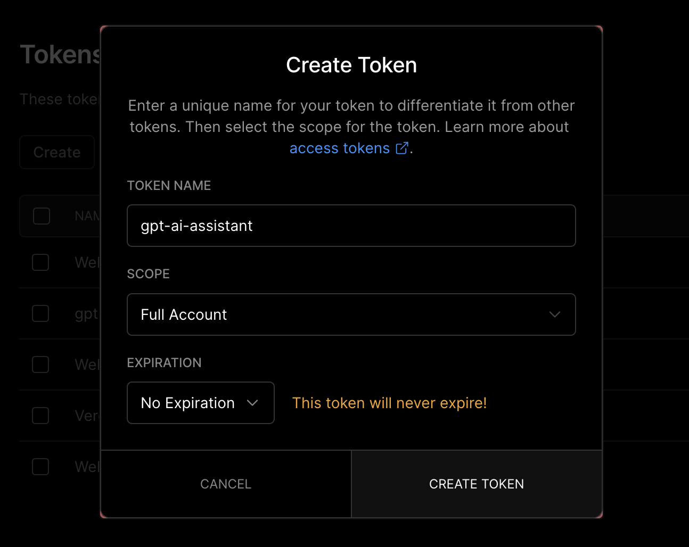

# GPT AI Assistant 2.0

## 功能介紹

### 增強回應

新版本推出了「增加回應」功能，讓 AI 助理針對群組對話做出特殊回應。將 AI 助理加入到小型群組中，可以讓群組聊天更有樂趣。

在 LINE 手機應用程式輸入指令，以執行特定功能。

指令 | 別名 | 說明
--- | --- | ---
`建議` | `/advise` | 請 AI 助理做出「建議」回應。
`分析` | `/analyze` | 請 AI 助理做出「分析」回應。
`道歉` | `/apologize` | 請 AI 助理做出「道歉」回應。
`譴責` | `/blame` | 請 AI 助理做出「譴責」回應。
`安慰` | `/comfort` | 請 AI 助理做出「安慰」回應。
`抱怨` | `/complain` | 請 AI 助理做出「抱怨」回應。
`嘲諷` | `/laugh` | 請 AI 助理做出「嘲諷」回應。
`總結` | `/summarize` | 請 AI 助理做出「總結」回應。

### 指令菜單

輸入「指令」指令，即可以查詢所有可用的指令。

### 關閉自動回覆

使用「關閉自動回覆」指令，可以將自動回覆關閉。

### 呼叫

AI 助理預設的名稱是「AI」，當關閉自動回覆後，使用「AI 你好」的方式呼叫。透過修改 `BOT_NAME` 環境變數來自訂名稱。

### 圖像生成

使用「請畫」指令，讓 AI 助理生成圖片。透過修改 `OPENAI_IMAGE_GENERATION_SIZE` 環境變數來改變尺寸大小。

### 限制群組數量

透過修改 `APP_MAX_GROUPS` 環境變數來限制使用 AI 助理的群組數量。

### 限制用戶數量

透過修改 `APP_MAX_USERS` 環境變數來限制使用 AI 助理的用戶數量。

## 升級指南

### 步驟ㄧ

為了讓 GPT AI Assistant 在群組中有更好的使用體驗，建議在 Vercel 平台的 [Personal Account Settings](https://vercel.com/account/tokens) 頁面，建立一個 Vercel 的 [access token](/demo/vercel-access-token.png)。

  

### 步驟二

在 Vercel 平台新增以下環境變數。

名稱 | 預設值 | 說明
--- | --- | ---
`VERCEL_ACCESS_TOKEN` | `null` | Vercel 的 [access token](/demo/vercel-access-token.png)
`BOT_NAME` | `AI` | AI 助理的名字，在關閉自動回覆時用來呼叫。
`APP_MAX_GROUPS` | 1 | 群組數量上限
`APP_MAX_USERS` | 5 | 用戶數量上限

檢查以下環境變數是否已更名。

舊名 | 新名
--- | ---
`LINE_API_KEY` | `LINE_CHANNEL_SECRET`
`LINE_CHANNEL_SECRET` | `LINE_CHANNEL_ACCESS_TOKEN`

### 步驟三

回到 [GitHub](https://github.com/) 平台，進到自己的 `gpt-ai-assistant` 專案頁面，點選「Sync fork」選單，再點選「Update branch」或「Discard commit」按鈕，以同步最新的程式碼到自己的儲存庫。

當 Vercel 機器人偵測到程式碼有變更，將會自動重新部署。

  

## 錯誤回報

請到「[Issues](https://github.com/memochou1993/gpt-ai-assistant/issues)」頁面，點選「New issue」按鈕，描述你的問題，並附上螢幕截圖。

## 功能建議

請到「[Issues](https://github.com/memochou1993/gpt-ai-assistant/issues)」頁面，點選「New issue」按鈕，描述你的功能建議。
