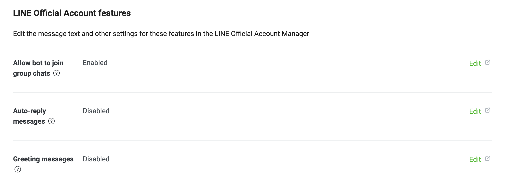

# 升級指南：GPT AI Assistant v2

新版本推出了一系列的「總結指令」、「分析指令」和「翻譯指令」，能夠讓 AI 做出各式各樣的分析與總結。

同時也考量了加入到群組中會遇到的問題，現在透過「關閉自動回覆」指令，就可以讓使用者必須呼叫名字才能與 AI 對話。透過設置環境變數，還可以自訂 AI 助理的名字、限制群組和用戶數量。另外，還新增了畫圖功能，支援英、日文對話。

馬上透過升級指南，即可將 AI 助理加入到小型群組中，讓群組聊天變得更有樂趣！

## 功能介紹

### 總結指令

「總結指令」可以要求 AI 助理以不同的態度針對對話內容做出總結。

指令 | 別名 | 說明
--- | --- | ---
`建議` | `/advise` | 請 AI 助理做出「建議」總結。
`道歉` | `/apologize` | 請 AI 助理做出「道歉」總結。
`譴責` | `/blame` | 請 AI 助理做出「譴責」總結。
`安慰` | `/comfort` | 請 AI 助理做出「安慰」總結。
`抱怨` | `/complain` | 請 AI 助理做出「抱怨」總結。
`鼓勵` | `/encourage` | 請 AI 助理做出「鼓勵」總結。
`嘲諷` | `/laugh` | 請 AI 助理做出「嘲諷」總結。
`總結` | `/summarize` | 請 AI 助理做出「總結」總結。

### 分析指令

「分析指令」可以要求 AI 助理使用不同的學科角度針對對話內容做出分析。

指令 | 別名 | 說明
--- | --- | ---
`分析` | `/analyze` | 請 AI 助理分析。
`文學分析` | `/analyze-literarily` | 請 AI 助理以文學角度分析。
`數學分析` | `/analyze-mathematically` | 請 AI 助理以數學角度分析。
`命理學分析` | `/analyze-numerologically` | 請 AI 助理以命理學角度分析。
`哲學分析` | `/analyze-philosophically` | 請 AI 助理以哲學角度分析。
`心理學分析` | `/analyze-psychologically` | 請 AI 助理以心理學角度分析。

### 翻譯指令

「翻譯指令」可以要求 AI 助理將最後一句話翻譯成指定語言。

指令 | 別名 | 說明
--- | --- | ---
`翻成英文` | `/translate-to-en` | 請 AI 助理翻譯成英文。
`翻成日文` | `/translate-to-ja` | 請 AI 助理翻譯成日文。

### 指令菜單

輸入「指令」指令，即可查詢所有可用的指令。

### 關閉自動回覆

輸入「關閉自動回覆」指令，即可將自動回覆關閉。需要設置 `VERCEL_ACCESS_TOKEN` 環境變數。

### 喚醒對話

AI 助理預設的名稱是「AI」，當關閉自動回覆後，使用「AI 你好」的方式喚醒對話。透過修改 `BOT_NAME` 環境變數即可自訂名稱。

### 圖像生成

使用「請畫」指令，讓 AI 助理生成圖片。透過修改 `OPENAI_IMAGE_GENERATION_SIZE` 環境變數即可改變尺寸大小。

### 限制群組數量

透過修改 `APP_MAX_GROUPS` 環境變數來限制使用 AI 助理的群組數量。

### 限制用戶數量

透過修改 `APP_MAX_USERS` 環境變數來限制使用 AI 助理的用戶數量。

## 升級指南

### 步驟ㄧ

為了讓 GPT AI Assistant 有更好的使用體驗，首先在 Vercel 平台的 [Personal Account Settings](https://vercel.com/account/tokens) 頁面，生成一個 Vercel 的 [access token](/demo/vercel-access-token.png)。

  

### 步驟二

在 Vercel 平台的 `gpt-ai-assistant` 專案，新增以下環境變數：

名稱 | 預設值 | 說明
--- | --- | ---
`VERCEL_ACCESS_TOKEN` | `null` | Vercel 的 [access token](/demo/vercel-access-token.png)
`BOT_NAME` | `AI` | AI 助理的名字，在關閉自動回覆時用來呼叫。
`APP_MAX_GROUPS` | 1 | 群組數量上限
`APP_MAX_USERS` | 5 | 用戶數量上限

檢查以下環境變數是否套用新的名稱：

舊的名稱 | 新的名稱
--- | ---
`LINE_API_KEY` | `LINE_CHANNEL_ACCESS_TOKEN`
`LINE_API_SECRET` | `LINE_CHANNEL_SECRET`
`VERCEL_API_KEY` | `VERCEL_ACCESS_TOKEN`
`SETTING_AI_NAME` | `BOT_NAME`

### 步驟三

回到 [GitHub](https://github.com/) 平台，進到自己的 `gpt-ai-assistant` 專案頁面，點選「Sync fork」選單，再點選「Update branch」或「Discard commit」按鈕，以同步最新的程式碼到自己的儲存庫。

當 Vercel 機器人偵測到程式碼有變更，將會自動重新部署。

  

### 步驟四

如果要將 AI 助理加入到群組中，記得到 [LINE](https://developers.line.biz/) 平台，將「Allow bot to join group chats」功能開啟。

  

## 錯誤回報

請到「[Issues](https://github.com/memochou1993/gpt-ai-assistant/issues)」頁面，點選「New issue」按鈕，描述你的問題，並附上螢幕截圖。

## 功能建議

請到「[Issues](https://github.com/memochou1993/gpt-ai-assistant/issues)」頁面，點選「New issue」按鈕，描述你的功能建議。
